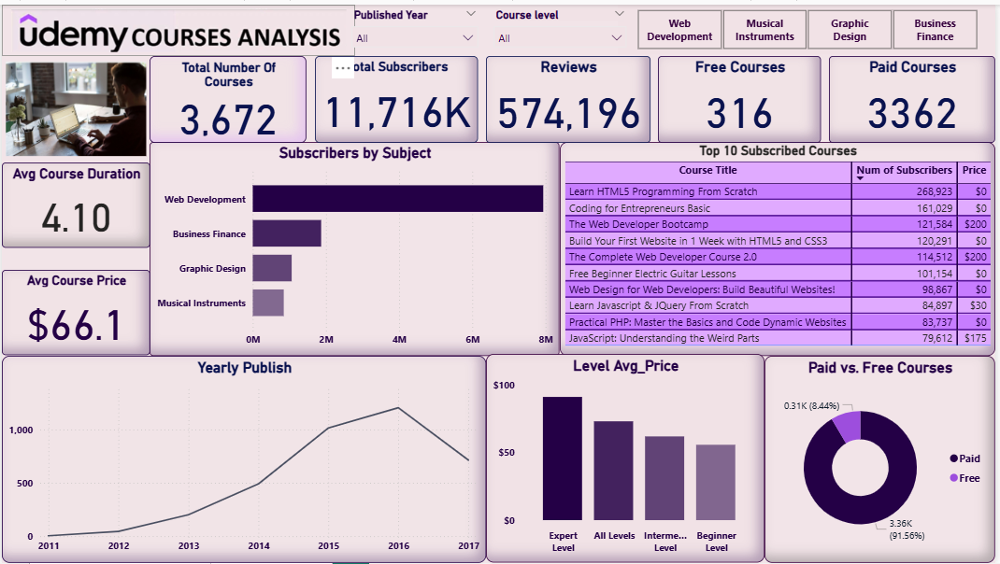
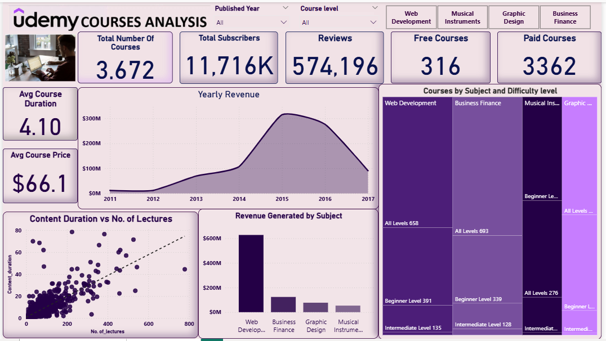

# Udemy Courses Analysis – Power BI Dashboard

## 📌 Project Overview
This project presents an **interactive Power BI dashboard** analyzing Udemy course data to uncover insights into course distribution, pricing, popularity, revenue generation, and publishing trends.

The dashboard answers questions such as:
- Which subjects have the highest number of subscribers?
- How do free vs. paid courses compare?
- What is the yearly publishing trend?
- Which are the top subscribed courses and their prices?
- How does course duration relate to number of lectures?
- Which subjects generate the most revenue?

---

## 📂 Dataset
- **File:** [`udemy_courses.xlsx`](udemy_courses.xlsx)  
- **Source:** Udemy Courses dataset (Excel format)

---

## 🛠 Data Preparation
Full details can be found in [`docs/data_preparation.md`](data_preparation.md).

**Summary of Cleaning Steps:**
- Removed duplicates
- Filled missing values (`price`, `num_subscribers`, `num_reviews`)
- Converted `published_timestamp` to Date format
- Standardized subject categories
- Added calculated columns for `Year` and `Revenue`
- Categorized into Free/Paid

---

## 📊 Dashboard Features
**Page 1 – Overview**
- KPIs for Total Courses, Subscribers, Reviews, Free vs. Paid, Avg Duration, Avg Price
- Subscribers by Subject (Bar Chart)
- Top 10 Subscribed Courses table
- Yearly Publish Trend (Line Chart)
- Avg Price by Level (Bar Chart)
- Paid vs. Free Distribution (Donut Chart)

**Page 2 – Revenue Insights**
- Yearly Revenue (Area Chart)
- Content Duration vs. Lectures (Scatter Plot)
- Revenue by Subject (Bar Chart)
- Courses by Subject & Level (Treemap)

---

## 🖼 Screenshots

**Dashboard Page 1 – Overview**  


**Dashboard Page 2 – Revenue Insights**  


---

## 📦 Tools Used
- **Microsoft Power BI** – Visualization
- **Excel** – Data source
- **DAX** – Calculated measures & columns

---

## 🚀 How to Use
1. Clone the repository:
   ```bash
   git clone https://github.com/Kingsley-Morrison/udemy-courses-analysis.git
   ```
2. Open `dashboard/udemy_courses_analysis.pbix` in **Power BI Desktop**.
3. Connect to `data/udemy_courses.xlsx` if prompted.
4. Use the slicers and charts to explore insights.

---

## 📜 License
This project is under the MIT License.
